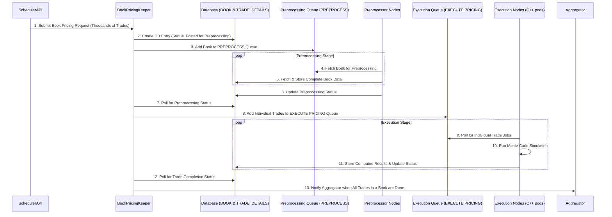
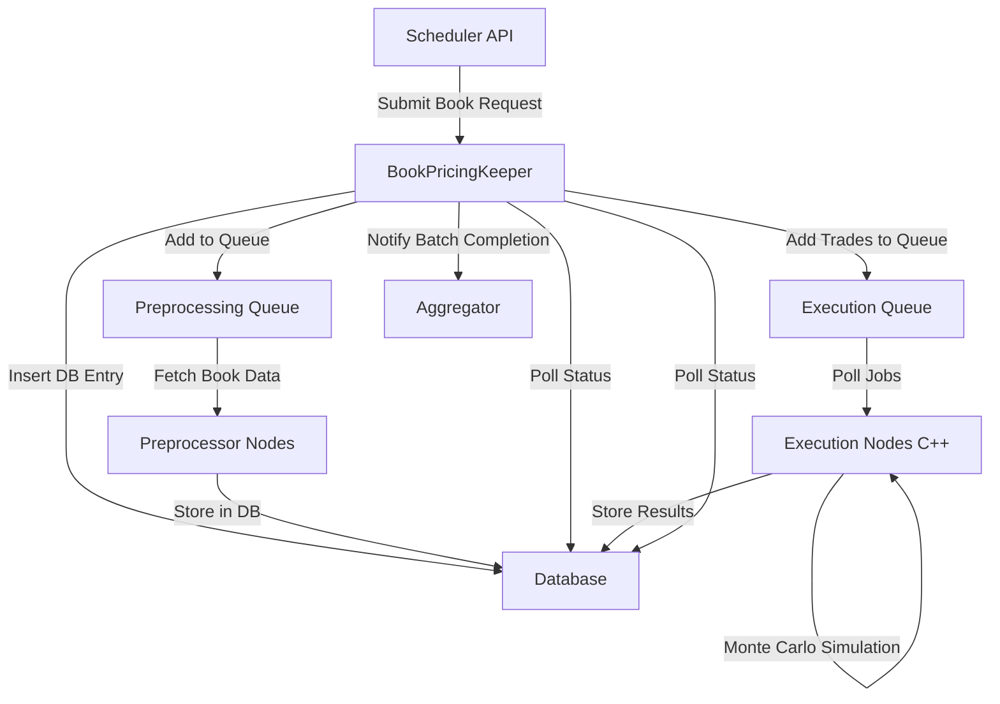

# Monte Carlo Pricing System

## **Sequence Diagram**

## **Block Diagram**

## **Module Breakdown**

### **1️⃣ Scheduler API**
- Accepts book pricing requests.
- Sends book details to **BookPricingKeeper**.

### **2️⃣ BookPricingKeeper**
- Manages the workflow.
- Stores book metadata and trades in the **DB**.
- Sends tasks to preprocessing and execution queues.
- Notifies **Aggregator** on completion.

### **3️⃣ Database (BOOK & TRADE_DETAILS)**
- Stores book metadata and individual trade details.

### **4️⃣ Preprocessing Queue (PREPROCESS)**
- Holds books waiting for preprocessing.

### **5️⃣ Preprocessor Nodes**
- Fetch complete book data and save it to **DB**.

### **6️⃣ Execution Queue (EXECUTE PRICING)**
- Holds individual trade pricing tasks.

### **7️⃣ Execution Nodes (C++ Pods on Kubernetes)**
- Poll for trade pricing jobs.
- Run **Monte Carlo simulations**.
- Store results in **DB**.

### **8️⃣ Aggregator Module**
- Listens for batch completion notifications.
- Aggregates results for reporting.

---

## **🚀 Kubernetes Auto-Scaling**
- Scales pods **based on queue length** (if many jobs are waiting, more pods are spawned).

---

## **🛠️ Tech Stack**

| **Component**    | **Technology Choices**                                |
| ---------------- | ----------------------------------------------------- |
| **Job Queues**   | Redis Queue                         |
| **Orchestrator** | Kubernetes (K8s)                                      |
| **Worker Nodes** | C++ Monte Carlo Programs (Running in Kubernetes Pods) |
| **Database**     | PostgreSQL                           |
| **Monitoring**   | Prometheus + Grafana                                  |
| **Logging**      | ELK Stack (Elasticsearch, Logstash, Kibana)           |

---
